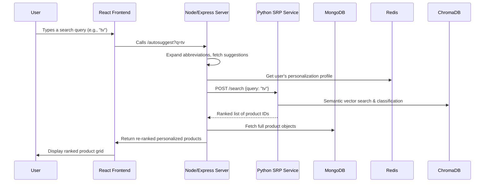

# Flipkart Grid Final Submission

## 🌟 Welcome to the Ultimate Flipkart-Style Search Experience!

This repository delivers a cutting-edge, production-ready, AI-powered personalized e-commerce search engine modeled after Flipkart. It features **real-time autosuggest**, **intelligent abbreviation expansion**, **deep personalization**, and modern search ranking fueled by semantic embeddings, all built atop a robust microservices architecture.

## 📸 Infographics & System Diagrams

### 🏗️ System Architecture (Mermaid)

```mermaid
graph TB
A[React Frontend] -- Search/Autosuggest --> B[Express.js API Layer]
B -- Query --> C[SRP Microservice(Python, FastAPI, ChromaDB, ML)]
B -- ElastiCache/Personalization --> D[Redis]
B -- Category/Product Fetch --> E[MongoDB]
C -- High-Speed Retrieval --> F[ChromaDB Vector DB]
style A fill:#61dafb,stroke:#333,stroke-width:2px
style B fill:#339933,stroke:#333,stroke-width:2px
style C fill:#f4b942,stroke:#333,stroke-width:2px
style D fill:#dc382d,stroke:#333,stroke-width:2px
style E fill:#4ea94b,stroke:#333,stroke-width:2px
style F fill:#005571,stroke:#333,stroke-width:2px
```

### 🔄 Search Flow Diagram



## ✨ Features at a Glance

- **🚀 Blazing Fast Personalized Search** (Python FastAPI + ChromaDB, Node.js, MongoDB)
- **🎯 Smart Autosuggest** with real-time abbreviation mapping
    - e.g., "tv" ➡️ "Televisions", "ac" ➡️ "Air Conditioners"
- **🤖 Deep Learning Embeddings** for meaning-aware, typo-tolerant semantic matches
- **🧠 Personalized Results** powered by Redis: click tracking & behavioral boosts
- **🦾 Multi-engine Architecture** with ES fallback, hybrid scoring, and vector reranking
- **🎨 Frontend: Modern UX** with React + Material-UI, debounce/keyboard navigation
- **🔒 Secure Auth & JWT** for persistent user sessions
- **💳 Payment Ready** (Razorpay integrated, mock flow)
- **⬆️ Effortless Data Import** from CSVs

## 💡 User Journey

1. **Instant Smart Autosuggest**: As you start typing, the input is expanded with common e-commerce abbreviations and personalized using your browse history.
2. **SRP (Semantic Retrieval Pipeline)**: Hybrid pipeline classifies your intent and vectors the search for hyper-relevant results, reranking with cross-encoder models.
3. **Personalized Search Results**: Your recent interests, clicks, and category journeys shape your top results.
4. **Deep Filtering**: Faceted filters for price, brand, category, and more on the client.
5. **Seamless Cart & Checkout**: Persistent cart, modern payment flow with Razorpay integration.

## 🏅 Technical Highlights

### 1. **Autosuggest & Abbreviation Intelligence**
- *(Super Fast)*: LRU memory cache for <150ms responses.
- *(Intelligent)*: 50+ mappings auto-expand search terms.
- *(Personalized)*: Clicked products and categories appear first.

### 2. **Personalization, Scoring, and Click Tracking**
- Instantly adapt search and autosuggest based on **recent clickstream** (stored in Redis).
- Hybrid scoring algorithm (personalization, exact/prefix/substr match, relevance, behavioral signals).

### 3. **SRP (Semantic Retrieval Pipeline) - Python Microservice**
- **Intent classification** via vector search over subcategory embeddings
- **Product retrieval**: multi-stage, with asynchronous concurrent category fetch
- **Reranking**: Cross-encoder reorders by deep semantic relevance

### 4. **API Example**

```json
GET /search?q=smartphone&userId=123
{
  "results": [
    { "type": "category", "name": "Smartphones", "match_score": 950 },
    {
      "type": "product",
      "id": "64f7a8b2c1234567890",
      "title": { "longTitle": "iPhone 15 Pro Max", "shortTitle": "Smartphones" },
      "rating": 4.8,
      "match_score": 875
    }
  ]
}
```

## 📦 Tech Stack

| Layer             | Tech           |
|-------------------|---------------|
| Frontend          | React, Material-UI |
| Gateway/API       | Node.js (Express) |
| ML/Semantic Layer | Python FastAPI  |
| Vector DB         | ChromaDB       |
| Storage           | MongoDB, Redis |
| Search Engine     | Elasticsearch  |
| Payment           | Razorpay (mocked) |

## 🛠️ Getting Started

```bash
# Clone the repo
git clone https://github.com/your-username/flipkart-grid-search.git && cd flipkart-grid-search

# Backend (Node)
cd server && npm install && npm start

# Python SRP API
cd ../SRP && pip install -r requirements.txt
uvicorn app.main:app --host 0.0.0.0 --port 8001

# Frontend
cd ../client && npm install && npm start
```

Check `.env.example` for all configuration essentials!

## 📝 Key Algorithms

```javascript
const scoringWeights = {
  personalization: 1000, // Clicked product/category
  exactMatch: 900,
  prefixMatch: 500,
  categoryPrefix: 200,
  substringMatch: 100,
  categorySubstring: 50
};
```

1. **Personalization Boost**: Clicked products/categories
2. **Intent Classification**: Query embedding ➡️ Top K categories via vector search
3. **Hybrid Search**: Vector search with fallback to fuzzy exact/substring match

## 🚀 Demo (Screenshots)

- **Autosuggest**: Smart category & product mix, instant updates, highlighted terms
- **SRP Results Page**: Sort & filter sidebar, dynamic grid, click-to-track, personalized rankings
- **Cart & Checkout**: Full flow from add-to-cart to payment (mocked)

## 🧩 Extensibility

- Drop in new embeddings/reranker models with config change.
- Add new click-based features — "Recently Seen", "Advance Recommendations", etc.
- Plug-in your analytics — all endpoint logs and timings built in!

## 🤝 Contributing

We're open to issues, improvements, new scoring tricks, and more! Fork, star, and make a PR. For ideas, see `TODO.md`.

## 🥇 Why This Repo?

- **Best-of-breed architecture** for high-traffic, production e-commerce.
- **Beautiful, modular code** — ready for extension and learning.
- **Detailed docs and code comments** throughout.

## 🦄 Try it. Fork it. Make e-commerce magical!

[1] https://ppl-ai-file-upload.s3.amazonaws.com/web/direct-files/attachments/52814332/ecc83392-1567-429a-beb4-0dab52b547b1/repomix-output.xml
