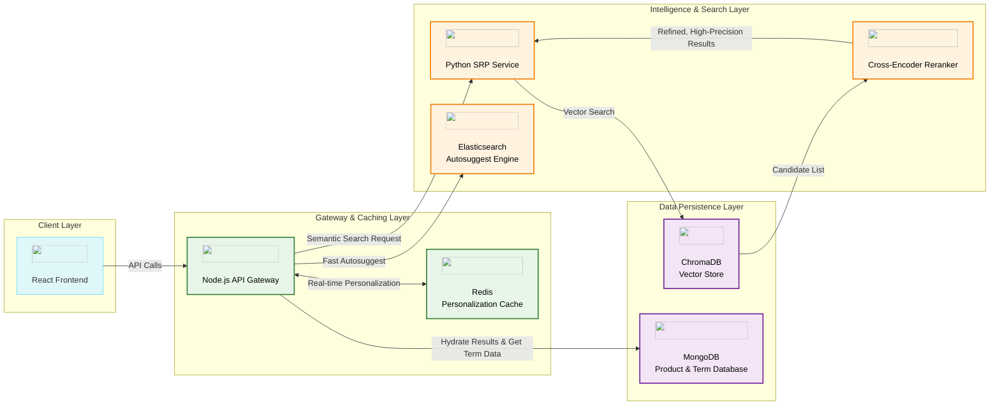
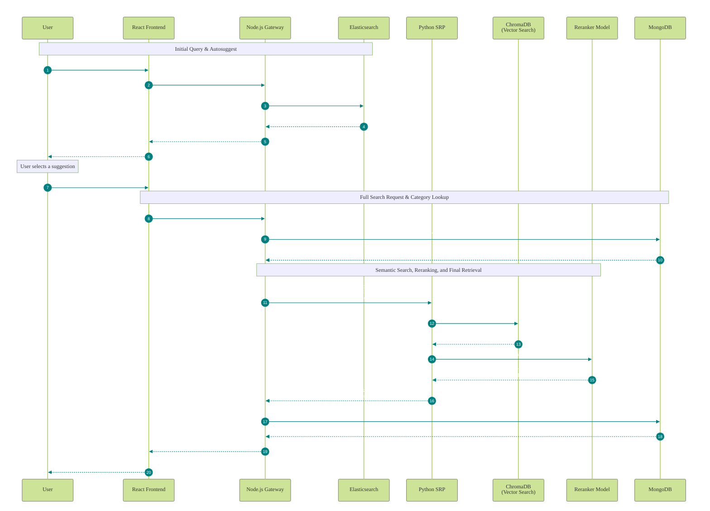

# Flipkart Grid Search: AI-Powered Semantic Search Engine 🚀


This repository delivers an enterprise-grade, AI-powered personalized e-commerce search engine. It moves beyond simple keyword matching to **understand user intent**, delivering a hyper-relevant, intelligent, and incredibly fast shopping experience modeled after Flipkart's advanced search capabilities.

-----

## 🌟 Key Features

| Feature                          | Description                                                                                                                                                             |
| -------------------------------- | ----------------------------------------------------------------------------------------------------------------------------------------------------------------------- |
| ✅ **Search Results Page Pipeline (SRP)** | A Python microservice using ML models to understand the *meaning* behind a query, not just the words. Handles typos and finds related products effortlessly.       |
| ✅ **Intent Classification**     | Before searching, the SRP classifies your query (e.g., "cheap running shoes") into a product category ("Men's Sports Shoes") for laser-focused results.                  |
| ✅ **Intelligent Autosuggest**   | A hybrid system using Elasticsearch provides instant suggestions for products, categories, *and* specific search phrases (e.g., "top load washing machine").           |
| ✅ **Real-Time Personalization** | Using Redis, the engine tracks user clicks on products and categories to boost their rankings in subsequent searches and suggestions, all in real-time.                 |
| ✅ **Abbreviation Expansion**    | Automatically expands common e-commerce shorthand (e.g., "tv" -> "Televisions", "ac" -> "Air Conditioners") for both search and autosuggest, improving accuracy. |
| ✅ **Robust Microservice Arch.**   | A decoupled frontend, Node.js gateway, and Python ML service make the system scalable, maintainable, and resilient.                                                   |
| ✅ **Advanced Filtering & UI**   | A fast, responsive React/Material-UI frontend with comprehensive filters for price, brand, category, and rating, enabling users to drill down to what they need.       |


-----
## 🏗️ System Architecture

Our architecture is a carefully orchestrated dance between specialized services, ensuring both speed and intelligence. The Node.js server acts as the central gateway, delegating tasks to the optimal engine for the job.



-----

## 🔄 The Hybrid Search Flow: A Tale of Two Queries

Our system uses two distinct pipelines for a superior user experience: one for lightning-fast suggestions, and another for deep, intelligent search results.



-----

## 🧮 Algorithms & Intelligence

### 1. Autosuggest Scoring (Elasticsearch & Node.js)

For instant suggestions, we use a custom scoring model in Node.js on top of Elasticsearch's powerful text search.

```javascript
// Scoring Priorities for Autosuggest (Higher = Better Rank)
const scoringWeights = {
  exactMatch: 1000,  // Query matches a full term 
  prefixMatch: 800,       // Term starts with the query
  personalization: 500,      // Frequently clicked items from Redis for the user
  ProductMatch: 250,   // Term contains the query
};
```

### 2. Search Results Page Pipeline (Python SRP)

Our Search Results Page (SRP) uses a rigorously validated, multi-stage pipeline to ensure highly relevant and diverse results:

1. **Intent Classification & Result Diversification**  
   - We embed the user’s query (e.g. “Washing Machines”) into a vector.  
   - That embedding is compared not only to subcategory names, but also to their standardized abbreviations and a curated set of related terms in our **ChromaDB** category index.  
   - We then select the top *K* **unique** subcategories—ensuring that we cover distinct facets of the user’s intent and maximize result diversification.  

2. **Candidate Retrieval**  
   - For each of those *K* subcategories, we perform a vector search in the **ChromaDB** product index.  
   - We retrieve the top *M* products per category, giving us a pool of *K × M* candidates that are all semantically close to the query.  

3. **Cross-Encoder Reranking**  
   - A state-of-the-art Cross-Encoder model takes the original query and each candidate’s metadata (title, description, attributes).  
   - It produces a fine-grained relevance score for every candidate.  
   - We sort the *K × M* set by this score to produce a final, precision-optimized ranking of product IDs, which is returned in the API response.  

This design guarantees both **deep semantic understanding** of user intent and **result diversification**, while leveraging a powerful Cross-Encoder for ultimate ranking accuracy.  


-----

## 🛠️ Getting Started: A Foolproof 4-Terminal Setup

This is a multi-service application. The easiest way to run it is with four separate terminal windows.

### Prerequisites

*   Node.js (v16+) & npm
*   Python (v3.10+) & pip
*   Docker & Docker Compose (or a local ChromaDB install)

### Step 1: Clone the Repository & Configure
---
```bash
git clone https://github.com/Darkcaptain007/Grid-Flipkart.git
cd Grid-Flipkart
or
cd Grid-Flipkart-main

# Create the .env file for the Node server
cp server/.env.example server/.env
# NOW, EDIT server/.env and add your MongoDB Atlas password
```

### Step 2: Run the Services
---
Open two terminals for this step.

**➡️ Terminal 1: Start Elasticsearch via Docker**
```bash
docker run -p 9200:9200 -p 9300:9300 \
  -e "discovery.type=single-node" \
  -e "xpack.security.enabled=false" \
  docker.elastic.co/elasticsearch/elasticsearch:8.14.1
```
Wait for this to show a success message before proceeding.

**➡️ Terminal 2: Start Redis via Docker**

```bash
docker run -p 6379:6379 redis
```

This will start and run in the foreground.

### Step 3: Run the Application Services
---
Open four more terminals for your application code.

**➡️ Terminal 3: Start the SRP Microservice (Python)**

From the root directory, open terminal and run these commands:

```bash
cd SRP
docker-compose up --build
```

When the terminal show output like
```bash
Attaching to flipkart_srp_api                    
flipkart_srp_api  | INFO:     Started server process [8]                                                        
flipkart_srp_api  | INFO:     Waiting for application startup.
flipkart_srp_api  | INFO:     Application startup complete.
```
then open another terminal and run the below command.

**➡️ Terminal 4: For Bulk Indexing**

```bash
cd SRP
docker-compose exec srp_api python scripts/bulk_indexer.py
```
Wait for this message *--- Bulk Indexing Complete for all collections! ---*

**➡️ Terminal 5: Start the Frontend (React)**
```bash
cd client
npm install
npm start
```
*Your application will be available at `http://localhost:8000`.*

**➡️ Terminal 6: Index Your Data (One-Time Setup)**
This step is **critical** and populates your databases. Run these commands from the project root.
```bash
# 1. Populate MongoDB with product data
(cd server && node importData.js)

# 2. Populate MongoDB with category & search term data
(cd server && node importCategories.js)
```
After doing this, **restart the Node.js server (Terminal 1)** for it to create the Elasticsearch indices with the new data. The server will be hosted on  `http://localhost:8001`.

**You are all set!** Open `http://localhost:8000` and experience the search.

-----

## 🧩 Tech Stack Deep Dive

| Layer                      | Tech                                                                                                   | Purpose                                                                          |
| -------------------------- | ------------------------------------------------------------------------------------------------------ | -------------------------------------------------------------------------------- |
| **Frontend**               |  React, Material-UI | Building a fast, responsive, and modern user interface.                          |
| **Gateway & API**          |  Node.js (Express)      | Orchestrates all backend services, handles authentication, and serves API endpoints. |
| **Semantic Search (ML)**   |  Python (FastAPI)       | The AI brain. Handles intent classification, semantic retrieval, and reranking.  |
| **Vector Database**        |  ChromaDB                                 | Stores and enables ultra-fast similarity search on ML model embeddings.          |
| **Primary Data Store**     |  MongoDB                | Stores all product, category, and search term data.                              |
| **Real-time Personalization** |  Redis                  | Caches user clickstream data for instant personalization boosts.                 |
| **Autosuggest Engine**     |  Elasticsearch        | Provides lightning-fast, prefix-based search for the autosuggest dropdown.         |


## 🎥 Tech Stack Walkthrough (Live Demo)

Watch the [YouTube](https://www.youtube.com/watch?v=baw8FdGVHKs&feature=youtu.be) demo here.
